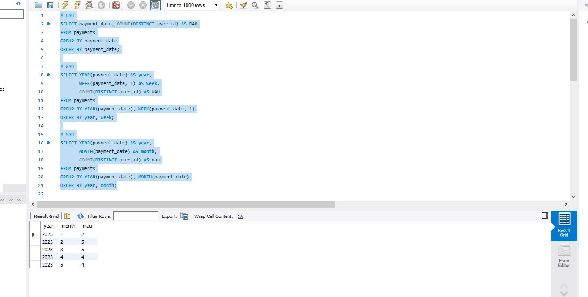

# Spotify Subscription SQL Analysis

SQL business analysis project focused on subscription metrics, user activity, retention, churn, and customer value.

## Project Overview

This project analyzes a music streaming subscription dataset using SQL.  
The goal is to calculate key business metrics that are commonly used in subscription-based products.

## Tables Used

- users
- subscriptions
- payments

## Business Questions

- How many users are active daily, weekly, and monthly?
- What is the average order value by user?
- What is the lifetime value of each user?
- Who are the top 5 customers by revenue?
- What is the retention rate?
- What is the churn rate?

## SQL Skills Demonstrated

- JOINs
- Aggregations
- GROUP BY
- Date functions
- CASE statements
- COALESCE
- KPI calculations
- Business metrics analysis

## Metrics Calculated

- DAU
- WAU
- MAU
- AOV
- LTV
- Top 5 customers by LTV
- Retention Rate
- Churn Rate

## Files

- `queries.sql` — SQL queries for business analysis
## Query Results

